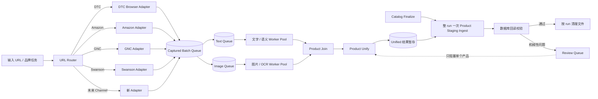

# 抓取与数据处理并行化改造计划

## 1. 目标

把当前“一个任务从抓取一直执行到入库，全部完成后才领取下一个任务”的串行流程，改成互不等待的处理流水线，外加一次 run 级收尾入库：

1. **抓取线（Capture）**：只负责从网站获得原始数据，持续领取下一个品牌或网站。
2. **文字处理线（Text / Semantic）**：消费已经抓到的文字、表格和结构化数据。
3. **图片处理线（Image / OCR）**：独立消费图片任务，识别 Supplement Facts 等证据。
4. **整合线（Join / Unify）**：等待同一个产品必需的文字和图片结果齐全后，统一产品名和 Variant，按 Batch 并行产出暂存结果。
5. **入库（Ingest，run 级一次）**：整个品牌 run 的所有 Batch 处理完成、Catalog Finalize 之后，一次性写入 Product Staging 并回读。入库是快速 RPC（每 200 条一次调用），不是吞吐瓶颈；保持 run 级一次可以完整复用现有 `completeCrawlRun` 的下架安全防线（见 6.4 节），不需要改动 Product Server。

核心原则：**抓取是抓取，数据处理是数据处理。处理上一批数据时，抓取线必须继续抓下一批。入库不追求并行，只追求安全。**

## 2. 当前问题

当前代码存在两个关键串行点：

- `apps/backend/src/repository.ts` 的 `buildJobDag()` 对 Amazon、GNC、Swanson 只创建一个 `process` Job。
- `apps/backend/src/gnc/pipeline.ts` 的 `runGncPipeline()` 在一个函数内依次执行：目录发现、商品抓取、Facts 提取、OCR、语义处理、Product Unify、入库和回读。

因此现在的实际流程是：

```text
抓完品牌 A
  -> 处理品牌 A 的全部文字
  -> 处理品牌 A 的全部图片
  -> Unify
  -> 入库
  -> 才开始抓品牌 B
```

这会造成以下问题：

- 浏览器在等待 Codex、Luna、OCR 和数据库时闲置。
- 一个大品牌会长时间占用 Worker，后面的品牌无法开始。
- 某个产品进入 `needs_review` 时，可能拖住整个品牌任务。
- 抓取速度很快，但整体吞吐量被最慢的语义处理阶段限制。
- 原始文件要等整个任务结束才清理，磁盘占用持续增长。

## 3. 目标架构



### 必须保证的并发关系

假设品牌 A 已经抓到第一批商品：

```text
时间轴：

抓取线       [抓 A 批次1][抓 A 批次2][抓 B][抓 C][抓 D]...
文字处理线             [处理 A1 文字][处理 A2 文字][处理 B 文字]...
图片处理线             [处理 A1 图片][处理 A2 图片][处理 B 图片]...
入库                                      [A 整 run 入库][B 整 run 入库]...
```

- A 的处理只能等待 A 对应的抓取结果，不能阻塞 B、C、D 的抓取。
- 图片线和文字线互不等待。
- Unify 只等待“同一个产品必需的文字和图片结果”。
- 入库等待整个 run 的处理结果齐全（Catalog Finalize 之后一次执行），但绝不反向阻塞任何抓取或处理线。
- Review 只暂停对应产品或批次，不能暂停其他产品，更不能暂停抓取线。

## 4. Adapter 的职责边界

所有 Adapter 只负责**来源相关的抓取**，不负责语义处理和入库。

### Adapter 应该做的事情

- 发现完整品牌目录或给定单品。
- 分页并提取商品 URL。
- 展开商品和 Variant。
- 提取页面中可机械读取的原始字段。
- 保存原始文字、HTML 表格、JSON、图片引用和证据来源。
- 按固定数量持续发布 Capture Batch。
- 在完整遍历目录后发布 Catalog Finalize 结果，用于判定 `full` 或 `partial`。

### Adapter 不应该做的事情

- 不运行 OCR。
- 不判断 Formula、Health Function、Form、Category。
- 不统一产品名。
- 不生成最终 Variant Key / Value。
- 不写 Product Staging 或 Product Restore。
- 不处理 Listing 上架、下架 Observation。
- 不因为下游处理速度慢而停止抓取，除非触发明确的磁盘或队列背压。

### 各 Adapter 的差异只存在于抓取方式

| Adapter | 运行位置 | 抓取内容 |
| --- | --- | --- |
| DTC | Windows Browser Node | 使用浏览器和 `crawl-products` Skill 获取页面、Variant、图片和原始证据 |
| Amazon | Mac mini 固定 Adapter | Brand Store / 品牌目录、ASIN、Variant、Rating、Review、销量提示、图片和 Label 证据 |
| GNC | Mac mini 固定 Adapter | 品牌目录、商品页、Variant、Rating、Review、月销量提示、Details、Ingredients、HTML Facts 和 PDF/Image 引用 |
| Swanson | Mac mini 固定 Adapter | 品牌目录、Constructor/Shopify 数据、商品页、Variant 和 Label 证据 |
| 后续 Target 等 | 对应节点的固定 Adapter | 只新增来源规则，输出同一 Capture Contract |

固定 Sales Channel 不需要每次调用 Skill。规则稳定后由 Adapter 机械抓取；只有 DTC 的未知站点发现阶段使用 `crawl-products` Skill。

## 5. 统一抓取产物

新增统一契约 `CapturedProductBatchV1`。每批建议包含 20～50 个产品；具体批量由 Adapter 配置。

每个产品至少包含：

```text
sourceType
channel
adapter
runId
batchId
catalogKey / siteKey
externalId
sku
productUrl
brandRaw
titleRaw
price
currency
availability
rating
reviewCount
unitsSoldText
rawVariantAttrs
descriptionText
detailText
ingredientText
factsEvidence
  - htmlTable
  - pdfUrl
  - imageRefs
images
sourceFiles
captureCompleteness
capturedAt
```

### 发布规则

- Batch 写入过程中使用临时状态。
- 所有文件写完并校验后，最后原子生成 `capture.ready.json`。
- 下游 Worker 只消费存在 `capture.ready.json` 的批次。
- 一个品牌不需要全部抓完才发布：抓到一批就立即发布一批。
- 品牌目录完全遍历后，另外发布 `catalog.finalized.json`。

> **现成实现可直接泛化**：Windows 端 `apps/browser-node/scripts/publish-capture-batch.mjs` 已经实现了完全相同的模式（staging → rename → `.tmp` → rename 成 `*.ready.json`，带防覆盖不可变守卫）；artifact 侧也有两阶段发布（create → upload → confirm 校验 sha256，下游只消费 `status='ready'`）。不要重新发明。

### 本地与远程传输

- Amazon、GNC、Swanson 在 Mac mini 本地运行：直接写本地 Staging，不上传 Railway，也不生成多余的 EvidenceBundle。
- DTC 在 Windows 抓取：仍通过现有 Artifact/Object Storage 传到 Mac mini；Mac mini 下载并展开后，转换成相同的 `CapturedProductBatchV1`。
- 从进入处理队列开始，DTC 和 Sales Channel 共用完全相同的下游流程。
- **注意**：`EvidenceBundleV1` 只在 `packages/contracts` 里声明过，Windows 端实际只发 `{ordinal, itemCount, evidenceDirectory}` 描述符（`publish-capture-batch.mjs`），并没有真正发出该契约。DTC → `CapturedProductBatchV1` 的转换起点比契约文件暗示的更裸，工作量按此评估。

建议目录：

```text
runs/<channel>/<runId>/
  capture/
    batch-000001/
      products/*.json
      files/*
      manifest.json
      capture.ready.json
    catalog.finalized.json
  process/
  ingest/
  review/
```

## 6. 队列和 Job DAG

### 新的 Job 类型

```text
capture_catalog
capture_batch_finalize
process_text
process_images
product_join
product_unify
catalog_finalize
ingest_staging
cleanup_run
review
```

### Batch 级依赖（并行 fan-out）

```text
capture_batch_finalize
  ├── process_text ────┐
  └── process_images ──┤
                       v
                  product_join
                       |
                  product_unify（结果写入 run 级暂存目录）
```

### Run 级依赖（每个品牌 run 一次）

```text
catalog_finalize（依赖：目录遍历完成 + 该 run 所有 Batch 的 product_unify 完成）
        |
  ingest_staging（一次性 ingestAndValidate：分片提交 + completeCrawlRun + 回读）
        |
  cleanup_run
```

Batch 级依赖只约束同一个 Batch。队列调度器不能把整个 Run 或整个品牌锁成一条串行任务。

### 队列机制现状（好消息：调度器不用重写）

`pipeline_job.depends_on` 是 Postgres `uuid[]` 列，claim 查询已有真正的依赖判定（`repository.ts:207`），天然支持按 Batch fan-out，上面的 DAG 可直接表达。**但必须先解除一个全局锁**：claim 查询含 `r.status not in ('needs_review', ...)`（`repository.ts:206`），而任何一个 job 进 `needs_review` 会把整个 run 置为 `needs_review`（`repository.ts:274`），冻结该 run 所有兄弟 job。改造时必须把 run 状态与 job 可领取性解耦（或按 Batch 建独立 run），否则单个产品的 Review 仍会停掉整条处理线。

### 6.4 为什么入库必须整 run 一次（下架安全）

`completeCrawlRun` 是 Product Server 的缺席下架触发器：run 声明 `scope: "full"` 时，服务端把本次 run 未观测到的 listing 判定下架。它藏在 `ingestAndValidate` 的尾部（`product-observation-client.ts:470-474`）。因此：

- **禁止按 Batch 调用 `ingestAndValidate`**——即使入库 Worker 串行排队也不行：第一个 Batch 入库就会触发 complete，把还没提交的批次全部误判下架。
- 正确做法：所有 Batch 的 Unify 结果暂存，Catalog Finalize 之后一次性调用 `ingestAndValidate`，与今天完全相同的时机，四道防线（`decideSalesChannelScope` 门禁、payload 二次降级、problems 提前返回、post-verify）原封不动。
- 后续优化（非关键路径）：客户端今天已对同一 runId 多次调用 `ingestObservationBatch`（每 200 条一次，`product-observation-client.ts:423-425`），服务端本就接受分批提交。未来可把 `ingestAndValidate` 拆成“每 Batch 提交观测 + run 级一次 complete”，实现边处理边提交。需先 smoke test 两点：服务端对长时间不 complete 的 run 是否有超时；分批提交时 run 的 scope 字段以哪次为准。
- 建议顺手向 Product Server 提一个兜底需求：单次 run 下架数超过阈值（如现存 listing 的 X%）时熔断转人工，防御 discovery 静默漏抓导致的 `full` 误判。

### Catalog Finalize 的独立职责

商品的抓取和处理按 Batch 提前进行，但入库和“哪些 Listing 已经下架”的判断都发生在完整品牌目录抓取结束后：

- `full`：目录完整遍历，可以为本次未观察到的 Listing 写下架 Observation。
- `partial`：单品、搜索、截断、挑战页或目录不完整，只能写本次看到的商品，不能将缺失商品判定为下架。
- 上架/上新：发现数据库中不存在的新 Listing 时创建。
- Catalog Finalize 出错只进入对应目录的 Review，不回滚已经验证通过的商品批次。

## 7. 各 Worker Pool

### 7.1 Capture Pool

- 按能力领取任务：`browser`、`amazon`、`gnc`、`swanson` 等。
- 抓取批次发布后立即继续当前目录或领取下一个品牌。
- GNC 的 IP 轮动属于 Capture Adapter 内部能力，不进入数据处理线。
- 每个 Sales Channel 可以单独配置并发、间隔、批量和代理出口。
- 不在 Capture 进程内启动 Codex、Luna 或 OCR。

### 7.2 Text / Semantic Pool

处理：

- 页面 Details、Description、Ingredients 等文字清洗。
- Ingredient Matters / Main Ingredients。
- Category。
- Form。
- Health Function。
- Formula 语义结构。
- 其他需要模型判断、但不依赖图片的字段。

优先级：

1. 已有结构化字段直接机械解析。
2. 明确文本使用规则或批量模型处理。
3. 只有模糊语义才调用 Codex/Luna。

该 Pool 的并发必须可配置，初始可沿用目前 Formula 10 并发，再根据限流、内存和吞吐量调整。

### 7.3 Image / OCR Pool

处理：

- 图片下载和去重。
- Facts 图片候选识别。
- OCR 并行识别。
- OCR 置信度检查。
- OCR 失败、模糊或结构损坏时才交给 Codex 视觉补救。

优先级：

1. 页面已有 HTML Supplement Facts：直接解析，不下载 PDF，不 OCR。
2. 没有 HTML Table、但 PDF 有可提取文本：机械解析 PDF 文本。
3. 只有 Facts 图片或扫描 PDF：进入 OCR。
4. OCR 仍无法形成可信结构：进入 Codex 视觉 Review。

初始 OCR 并发可沿用 4；后续根据 OCR 服务吞吐量单独调节，不影响抓取或文字线。

### 7.4 Product Join / Unify Pool

按 `channel + externalId`，或在 External ID 缺失时按规范化 URL/URL 中的 ASIN 等可靠标识聚合同一个产品的处理结果。

负责：

- 合并文字结果和图片/Facts 结果。
- 统一同一 Variant 系列的产品名。
- 提取 Variant Key / Value。
- 生成 baseName、variant、variantConfidence、variantSource。
- 校验品牌、名称、Ingredient、Form 等跨 Channel 身份信息。
- 无法机械确认身份时进入 Review。

如果某产品明确不需要图片结果，`process_images` 可以标记为 `not_required`，Join 不应空等。

### 7.5 Ingest Worker（run 级一次，不是按 Batch 的 Pool）

- 在 `catalog_finalize` 完成后触发，一个品牌 run 只执行一次。
- 合并该 run 所有 Batch 的 Unify 暂存结果，一次性调用 `ingestAndValidate`（内部已按 200 条分片提交）。
- 写 Product、Facts、Listing 和 Observation；`completeCrawlRun` 只在这里被调用一次。
- 执行数据库回读与数量/哈希校验。
- 成功后产生整 run 可清理标记。
- Review 数据保留在 Product Staging 和 Review Queue，待人工处理后再同步 Product Restore。
- 入库是快速 RPC，串行不构成吞吐瓶颈；Product Staging 暂时不可用时只影响收尾，不影响抓取和处理线。

## 8. Review 机制

Review 必须是旁路，不是全局停止条件。

**现状有两个代码级串行点必须移除，缺一不可：**

1. **队列层全局锁**：一个 job `needs_review` → 整个 run `needs_review`（`repository.ts:274`）→ claim 查询拒发该 run 所有 job（`repository.ts:206`）。见 §6“队列机制现状”。
2. **管线层 all-or-nothing**：`gnc/pipeline.ts:233-236`、`amazon/pipeline.ts:727-735` 的 `blocking` 列表——任何一个产品域名解析失败或 Unify 不完整，整个品牌都不入库。必须改成单产品隔离：问题产品进 Review Queue，其余产品照常参与 run 级入库。注意这个列表在下架安全上曾是保护（有问题就不会走到 `completeCrawlRun`），改成单产品隔离后，被隔离产品在 scope 判定中必须计入 `processedCount` 缺口，使 run 自动降级为 `partial`，防止“隔离了产品还声明 full”导致误下架。

可以机械判定的问题直接进入 Review Queue，例如：

- 图片不可访问。
- OCR 置信度不足。
- Facts 映射不完整。
- External ID 缺失且无法从 URL 恢复。
- Product Unify 置信度不足。
- 品牌或公司身份无法唯一映射。
- 入库回读不一致。

状态规则：

- 单产品问题：只标记该产品 `needs_review`。
- 单 Batch 问题：只暂停该 Batch。
- Catalog Scope 问题：只禁止该目录执行下架判断。
- 其他 Batch、品牌、Channel 和所有 Capture Worker 继续运行。

需要 Review 的文件一直保留；成功入库并回读通过的批次可以立即删除本地中间文件和远程 Artifact。

## 9. 背压与磁盘管理

抓取线正常情况下永远不等待处理线，但必须有安全背压，避免填满 Mac mini 硬盘。

建议使用两个阈值，具体数值通过环境变量配置：

- **软阈值**：暂停领取新的大目录，但允许当前 Batch 收尾和处理线继续释放空间。
- **硬阈值**：停止写入新 Capture 文件，只运行处理、入库和清理。

清理粒度保持整 run：入库回读通过后清理整个 run 目录和远程 Artifact（与现状一致，唯一删除点是 `cleanupRun`）。因为单品牌有商品数上限（当前 500），单 run 磁盘占用有界，配合软阈值背压足够。按 Batch 清理降级为后续优化——它依赖入库也按 Batch 提交（见 6.4 的后续优化），且要先解决 §10 说的文件缓存式续跑问题。

**现状**：仓库内没有任何磁盘空间检查（无 statfs/free-space 逻辑），软/硬阈值背压是 100% 从零建设，工作量不要低估。

以下内容不能自动删除：

- `needs_review` 的原始证据。
- 尚未完成数据库回读的批次。
- Catalog Finalize 尚未结束时需要用于完整性校验的目录清单。

## 10. 幂等、重试和恢复

- Capture Batch 使用稳定的 `runId + batchId`。
- 产品使用 `channel + externalId` 作为首选身份键。
- External ID 缺失时，从规范化商品 URL 中恢复 ASIN/SKU；仍无可靠标识才进入 Review。
- 每个阶段记录独立 checkpoint，进程重启后从未完成阶段继续。
- Worker Lease 过期后 Job 可重新领取。
- 重试不能重复写入 Product 或重复创建 Listing Observation。
- 同一 Batch 重跑必须得到相同幂等结果。
- IP challenge、网络超时和站点临时错误只重试 Capture 阶段，不重跑已完成的处理和入库阶段。

**现状与要求：**

- 今天的“断点续跑”实际是**文件存在性缓存**：每个昂贵步骤短路在缓存 JSON 上（captured/label/ocr/semantic/unify 各级 `.json`）。`LocalCheckpointStore`（SQLite）只写不读，不是真正的 resume；outbox 表有 enqueue 无消费。
- 新架构的 checkpoint 必须落在**队列状态**（job state + 暂存产物 + ready 标记），不能继续依赖“文件在就跳过”——否则与任何形式的中间清理都会冲突。
- 幂等键沿用 `clientRef = stableClientRef(channel, externalId)`（已存在）。不要延续 `capture:<jobId>:<itemCount>` 这种把可变值嵌进幂等键的写法——重试时 itemCount 变化会绕过幂等检查拿到新键。

## 11. 并发配置

所有并发值通过环境变量配置，不能写死在 Adapter 中。

建议第一版基线：

| Pool | 初始并发 | 说明 |
| --- | ---: | --- |
| GNC Capture | 1 | 当前代理选择器和 Chrome Session 先保持单 Lane；四个 IP 在 Lane 内轮动 |
| Amazon Capture | 1 | 与 GNC 分开配置，不共享 Worker 锁 |
| Swanson Capture | 1 | 与其他 Channel 独立 |
| DTC Browser Capture | 2 | 保持 Windows 两个 Browser Worker |
| Text / Formula | 10 | 根据 Codex/Luna 限流和 Mac mini 内存动态调整 |
| Image / OCR | 4 | 与文字线完全独立 |
| Product Unify | 2 | 可批量处理，先保护模型限流 |
| Ingest | 1 | 整 run 一次，挂在 Catalog Finalize 之后 |

这里的“GNC Capture 1”不代表系统一次只能运行一个任务。它只限制 GNC 浏览器抓取；同时仍可运行 Text 10、OCR 4、Unify 2，以及其他 Adapter 的 Capture。

如果未来需要同一个 Channel 多 Capture Lane，必须先让每条 Lane 使用隔离的 Chrome Profile、代理端口和出口选择器，不能共享一个全局 Clash Selector。

### 现有硬约束（必须先解除，否则上表无法落地）

- `NODE_MAX_CONCURRENCY` 的 zod 上限是 2（`mac-worker.ts:45`），且服务端按 `node.max_concurrency` 强制校验（`repository.ts:200`）。上表约 17 个并发槽位无法在单个现有 worker 进程内表达。
- `CODEX_CONCURRENCY` 是单 worker 进程内的全局信号量，默认 2、zod 上限 4（`mac-worker.ts:130`）。“Text 10”今天表达不出来；先确认 Codex/Luna 真实限流再放宽上限。
- GNC egress 守卫强制单槽专用 worker：开启 IP 轮动时必须 `NODE_MAX_CONCURRENCY=1` 且只挂 gnc（`mac-worker.ts:138-140`）。
- **结论：每个 Pool 必须是独立的 worker 进程**（各自注册 capability、各自配置并发），不能塞进现有 mac-worker 的 job 槽位。
- 新增 job stage / capability 需要三处协同修改：contracts 的 zod enum（`packages/contracts/src/index.ts:3-5`）、token→capability 映射（`config.ts:28-29`）、worker 的 capability schema（`mac-worker.ts:30`）。另外 **DB 需要一次迁移**（`003_pipeline_parallel.sql`，队列冒烟实测发现）：stage 有 CHECK 枚举约束，且 v1 有 `(run_id, stage)` 唯一约束——后者是"每 run 每 stage 一个 job"的隐式假设，直接堵死 Batch fan-out，必须删除。

## 12. 控制面和网页进度

网页应按流水线展示，而不是只显示笼统的“运行中任务数”。至少展示：

- Capture：排队品牌、正在抓取品牌、已发现/已抓商品数、当前 Channel、当前出口、挑战/冷却状态。
- Text：排队 Batch、处理中产品数、完成数、速率、模型错误/限流。
- Image/OCR：排队图片、已处理图片、Facts 成功数、OCR 失败数、速率。
- Join/Unify：等待文字、等待图片、可合并、Review 数。
- Ingest：待入库、已入库、回读通过、回读失败。
- Disk：Capture Staging 占用、Review 占用、可清理空间、背压状态。
- 每个品牌同时显示 Capture、Process、Ingest 的独立状态。

网页必须能够看见这种正常状态：**品牌 B 正在抓取，同时品牌 A 正在文字处理和 OCR。**

## 13. 实施步骤

### 阶段 0：冻结和基线

- 保留当前队列数据库和运行文件作为回滚，不删除。
- 保持当前串行 GNC Worker 停止，避免新旧流程同时消费同一任务。
- 记录现有抓取速度、文字速度、OCR 速度、磁盘增长和成功率。
- 为新架构创建独立的 Queue DB。注意：队列是 **Postgres** 而非 SQLite（`repository.ts` 用 `pg.Pool`）；照 `scripts/mac/start-local-control-plane.sh` 的方式建第二个 database（如 `crawl_control_plane_v2`）即可。

### 复用现有资产（先读代码再动手）

- **Amazon backfill 系统就是本计划的微缩版**：`amazon/backfill-state.ts` 已有 per-product lane 状态机（`text_status` / `image_status` / `join_status` / `staging_status`）、review_queue 表和 `resetStale` 恢复；`scripts/amazon-backfill-supervisor.ts` 并发跑 4 条 lane 并导出 `queue-status.json`。新架构的处理线状态机从这里提炼，别从零设计。§11 的“Formula 10 并发”正来自这里，不是 live pipeline。
- `runStreamingPipeline`（`amazon/ocr-label-pipeline.ts:239-289`）：现成的 OCR→模型生产者/消费者队列，目前是死代码。
- `publish-capture-batch.mjs`：现成的 ready-marker 原子发布模式（见 §5）。
- `hasCompleteFactsText`（`gnc/facts.ts:93-105`）：HTML Facts 短路已实现，§7.3 优先级 1 不需要重建。
- `stableClientRef` / `pipeline_idempotency`：幂等键体系已存在（见 §10）。

### 阶段 1：契约和队列

- 新增 `CapturedProductBatchV1` 和校验测试。
- 扩展 Job Stage / Capability（三处协同修改，见 §11）。
- **将 run 状态与 job 可领取性解耦**（`repository.ts:206/274` 的全局锁，见 §6/§8）——这是并行化的前提，必须在拆 GNC 之前完成。
- 修改 `buildJobDag()`，让所有来源都从 Capture 开始，按 Batch fan-out，并挂 run 级的 `catalog_finalize → ingest_staging → cleanup_run` 尾部。
- 实现 `capture.ready.json` 的原子发布和幂等消费（泛化 `publish-capture-batch.mjs` 模式）。
- 增加 Batch、Product Stage、Catalog Finalize 和 Review 状态。

### 阶段 2：先拆 GNC 验证通用框架

- 将 `runGncPipeline()` 拆为纯 Capture、Text、Image、Unify 模块 + run 级 Ingest。
- GNC Adapter 只保留目录发现、分页、商品抓取和 IP 轮动。
- 每抓到 20～50 个产品立即发布一个 Batch。
- HTML Facts 直接解析；只有缺少结构化 Facts 时才创建图片/OCR任务。注意 `hasCompleteFactsText` 短路已实现；但 HTML 路径目前每产品仍有一次 Codex 文本调用（`gnc/facts.ts:204-209`），若要改为纯机械解析属于新增工作，需单独评估准确率。
- 把 `blocking` all-or-nothing 列表改为单产品隔离（见 §8，含 scope 降级规则）。
- 在新 Queue DB 中重新创建现有 GNC URL，验证抓取线不会等待处理线。

GNC 是第一个验收 Adapter，但代码必须从第一天就是通用框架，不能再写一套 GNC 专用串行 Pipeline。

### 阶段 3：公共处理线

- 建立 Text Worker Pool（独立进程）。
- 建立 Image/OCR Worker Pool（独立进程）。
- 建立 Product Join / Unify Worker Pool（独立进程）。
- 建立 Catalog Finalize 后的 run 级 Ingest 与回读 Worker。
- 建立按 run 清理和 Review 保留机制。
- 加入磁盘软/硬阈值背压（全新建设）。

### 阶段 4：迁移其他 Adapter

- Amazon 改为只输出 Capture Batch。
- Swanson 改为只输出 Capture Batch。
- Windows DTC Artifact 下载后转换为同一 Capture Batch。
- 删除 Adapter 内重复的 OCR、语义、Unify 和入库逻辑。
- 保证所有来源经过同一套 Product Join、Unify 和 Ingest。

### 阶段 5：网页与运行验证

- 增加各 Pool 的独立进度和吞吐量。
- 连续运行至少一个完整 GNC 品牌目录。
- 同时增加第二、第三个品牌，确认不会等待第一个品牌处理结束。
- 注入 OCR 失败、模型限流、数据库回读失败和 IP challenge，确认只影响对应阶段。
- 验证 Worker 重启后可以从 checkpoint 恢复。

### 阶段 6：切换与清理

- 新流程达到验收标准后停止旧 Worker。
- 保留旧 Queue DB 一段观察期，仅作为只读回滚依据。
- 新流程稳定后再删除旧的单体 Pipeline 入口和无用中间结构。
- 未经确认不迁移、覆盖或删除旧数据库。

## 14. 验收标准

以下条件必须全部满足：

1. 抓取品牌 A 第一批后，处理线开始处理 A；与此同时抓取线继续 A 下一批或品牌 B。
2. Capture Worker 的日志中没有 OCR、Codex/Luna 语义、Product Unify 或数据库入库调用。
3. GNC 标准 HTML Facts 不产生 PDF 下载、OCR 或逐商品视觉模型调用（HTML 路径的每产品一次文本模型调用属现状，是否去掉另行评估）。
4. Text 和 Image/OCR 两条线能够同时消费不同或相同 Batch。
5. 单个产品 `needs_review` 不会让整个品牌或其他任务停止；被隔离产品导致该 run 的 scope 自动降级为 `partial`。
6. Product Staging 暂时不可用时，抓取线和处理线在未触发磁盘背压前继续运行，只有 run 级收尾入库等待。
7. `completeCrawlRun` 每个 run 只在 Catalog Finalize 后被调用一次；任何日志中不出现按 Batch 的 complete 调用。
8. 完整目录才允许执行下架 Observation；`partial` 不会误下架。
9. 网页能同时显示“品牌 B 抓取中、品牌 A 处理中、品牌 X 入库中”。
10. 重启任何一个 Worker Pool 不会丢任务，也不会重复入库。
11. 新增一个 Sales Channel 只需要实现 Adapter 和统一契约，不需要复制数据处理 Pipeline。
12. 吞吐量分别统计 Capture、Text、OCR、Unify 和 Ingest，能明确看见真实瓶颈。
13. 成功 run 在入库回读后清理（按 Batch 清理留作后续优化）。

## 15. 暂不做的事情

- 不修改用户手动选择的 Clash 节点；程序只使用配置好的分组和域名规则。
- 不在这次改造中直接写 Product Restore；先写 Product Staging，Review 完成后再同步。
- 不为了追求并发让多个 GNC Chrome Lane 共用同一个全局代理选择器。
- 不在新流程验收前删除旧队列、旧运行文件或旧代码。
- 不把本地 Sales Channel 产物绕到 Railway 再下载回来。
- **不按 Batch 调用 `ingestAndValidate` / `completeCrawlRun`**（下架安全，见 6.4）。“每 Batch 提交观测 + run 级一次 complete”的增量方案留作 smoke test 验证服务端行为后的后续优化。
- 不在这次改造中修改 Product Server；所有变更收敛在本仓库内。

## 16. 给 Review 模型重点检查的问题

1. 这个 DAG 是否真正允许 Capture 与所有数据处理阶段并发，而不是换名字后的串行流程？
2. Batch 级发布是否足以支持大品牌边抓边处理？
3. Catalog Finalize 与按 Batch 入库分开后，上下架 Observation 是否仍然安全？
4. Product Join 的必需/非必需依赖能否避免没有 Facts 图片的产品空等？
5. 本地 Sales Channel 与远程 DTC 是否能在 Capture Contract 后真正复用同一处理线？
6. Review、重试和磁盘背压是否会错误地暂停全局 Capture？
7. 幂等键是否足以避免重试造成重复 Product、Listing 或 Observation？
8. 当前建议并发是否符合 Mac mini 的内存、磁盘和模型限流约束？
9. 从现有 `buildJobDag()` 和单体 `runGncPipeline()` 迁移时，还遗漏了哪些隐式依赖？

## 17. 已知隐患清单（评审结论汇总）

| # | 隐患 | 位置 | 对策 |
| --- | --- | --- | --- |
| 1 | `completeCrawlRun` 藏在 `ingestAndValidate` 尾部，按 Batch 入库会误下架 | `product-observation-client.ts:470-474` | 入库改 run 级一次（本计划 6.4），禁止按 Batch 调用 |
| 2 | run 状态是全局杀开关：一个 `needs_review` 冻结整 run 所有 job | `repository.ts:206, 274` | 阶段 1 解耦 run 状态与 job 可领取性 |
| 3 | `blocking` 列表 all-or-nothing，一个产品失败整品牌不入库 | `gnc/pipeline.ts:233-236`, `amazon/pipeline.ts:727-735` | 单产品隔离 + scope 自动降级 `partial` |
| 4 | 并发硬上限：`NODE_MAX_CONCURRENCY≤2`、`CODEX_CONCURRENCY≤4`、GNC egress 强制单槽 | `mac-worker.ts:45, 130, 138-140` | 各 Pool 独立进程 + 放宽 zod 上限 |
| 5 | “断点续跑”实为文件存在性缓存；`LocalCheckpointStore` 只写不读 | `packages/runtime/src/index.ts:49-101` | checkpoint 落队列状态，不依赖文件在不在 |
| 6 | 新 capability 需三处协同修改，漏一处 worker 注册不上 | `contracts/src/index.ts:3-5`, `config.ts:28-29`, `mac-worker.ts:30` | 阶段 1 一次改齐 + DB 迁移 003（stage CHECK 约束、删 `(run_id,stage)` 唯一约束） |
| 7 | `EvidenceBundleV1` 只声明未实发，DTC 转换起点更裸 | `publish-capture-batch.mjs:34-40` | 阶段 4 按实际描述符评估工作量 |
| 8 | 磁盘背压和分线吞吐指标 100% 从零建 | 全仓库无 disk 检查；`repository.summary()` 只有状态计数 | 阶段 3/5 排期，别当成小活 |
| 9 | discovery 静默漏抓时 `full` 误判仍可能误下架（现有防线拦不住） | `sales-channel-scope.ts` 依赖抓取端自报证据 | 向 Product Server 提下架数量熔断阈值 |
| 10 | 幂等键嵌可变值（`capture:<jobId>:<itemCount>`）重试可绕过幂等 | `browser-node/src/index.ts:164` | 新契约不延续该写法 |

